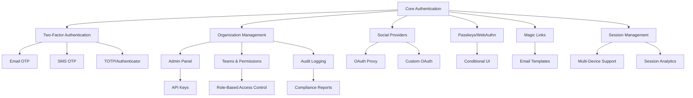

# Dual-Plugin Architecture System

## Overview

CF-Better-Auth implements a sophisticated dual-plugin architecture that ensures type safety and modularity across both server and client environments. This system provides a unified development experience while maintaining strict separation between server-side authentication logic and client-side authentication interfaces.

## System Architecture

The dual-plugin system consists of two complementary plugin interfaces that work together to provide a complete authentication solution:

```
┌─────────────────────────────────────────────────────────────┐
│                    Client Application                       │
├─────────────────────────────────────────────────────────────┤
│               Client Plugin Interface                       │
│  • Client Actions (signIn, signOut, getSession)             │
│  • State Management (NanoStore atoms)                       │
│  • Type Inference from Server Plugin                        │
├─────────────────────────────────────────────────────────────┤
│                    Network Boundary                         │
├─────────────────────────────────────────────────────────────┤
│               Server Plugin Interface                       │
│  • API Endpoints (/api/auth/signin, /api/auth/signout)      │
│  • Database Schema Extensions                               │
│  • Middleware and Hooks                                     │
│  • Rate Limiting and Security                               │
├─────────────────────────────────────────────────────────────┤
│                   Better-Auth Core                          │
└─────────────────────────────────────────────────────────────┘
```

## Server Plugin Interface

### Core Interface Definition

```typescript
interface BetterAuthPlugin {
  id: string;                              // Unique plugin identifier
  endpoints?: Record<string, AuthEndpoint>; // Custom API endpoints
  schema?: DatabaseSchema;                  // Database extensions
  hooks?: PluginHooks;                     // Lifecycle hooks
  middlewares?: Middleware[];              // Request middlewares
  rateLimit?: RateLimitConfig[];          // Rate limiting rules
  options?: PluginOptions;                 // Plugin configuration
}
```

### Detailed Interface Components

#### Endpoints Definition
```typescript
interface AuthEndpoint {
  method: 'GET' | 'POST' | 'PUT' | 'DELETE' | 'PATCH';
  path: string;
  handler: EndpointHandler;
  middleware?: Middleware[];
  rateLimit?: RateLimitConfig;
  validation?: ValidationSchema;
}

type EndpointHandler = (context: EndpointContext) => Promise<Response> | Response;

interface EndpointContext {
  request: Request;
  body: any;
  query: Record<string, string>;
  params: Record<string, string>;
  headers: Headers;
  user?: User;
  session?: Session;
  db: DatabaseAdapter;
  auth: AuthInstance;
}
```

#### Database Schema Extensions
```typescript
interface DatabaseSchema {
  tables?: Record<string, TableDefinition>;
  migrations?: Migration[];
  indexes?: Index[];
  relations?: Relation[];
}

interface TableDefinition {
  name: string;
  columns: Column[];
  primaryKey?: string | string[];
  foreignKeys?: ForeignKey[];
  uniqueConstraints?: UniqueConstraint[];
}
```

#### Plugin Hooks System
```typescript
interface PluginHooks {
  // Authentication lifecycle
  beforeSignIn?: (data: SignInData) => Promise<SignInData> | SignInData;
  afterSignIn?: (session: Session) => Promise<void> | void;
  beforeSignUp?: (data: SignUpData) => Promise<SignUpData> | SignUpData;
  afterSignUp?: (user: User) => Promise<void> | void;
  beforeSignOut?: (session: Session) => Promise<void> | void;
  afterSignOut?: (context: { userId: string }) => Promise<void> | void;
  
  // Session management
  beforeSessionCreate?: (session: Session) => Promise<Session> | Session;
  afterSessionCreate?: (session: Session) => Promise<void> | void;
  beforeSessionUpdate?: (session: Session) => Promise<Session> | Session;
  afterSessionUpdate?: (session: Session) => Promise<void> | void;
  beforeSessionDelete?: (session: Session) => Promise<void> | void;
  afterSessionDelete?: (context: { sessionId: string }) => Promise<void> | void;
  
  // User management
  beforeUserCreate?: (user: Partial<User>) => Promise<Partial<User>> | Partial<User>;
  afterUserCreate?: (user: User) => Promise<void> | void;
  beforeUserUpdate?: (user: Partial<User>) => Promise<Partial<User>> | Partial<User>;
  afterUserUpdate?: (user: User) => Promise<void> | void;
  beforeUserDelete?: (user: User) => Promise<void> | void;
  afterUserDelete?: (context: { userId: string }) => Promise<void> | void;
  
  // Request lifecycle
  beforeRequest?: (context: RequestContext) => Promise<RequestContext> | RequestContext;
  afterRequest?: (context: ResponseContext) => Promise<void> | void;
  onError?: (error: Error, context: ErrorContext) => Promise<void> | void;
}
```

### Example Server Plugin Implementation

```typescript
// plugins/multi-tenant/server.ts
import type { BetterAuthPlugin } from '@cf-auth/core';

export const multiTenantPlugin: BetterAuthPlugin = {
  id: 'multi-tenant',
  
  // Database schema extensions
  schema: {
    tables: {
      organizations: {
        name: 'organizations',
        columns: [
          { name: 'id', type: 'uuid', primaryKey: true },
          { name: 'name', type: 'varchar(255)', notNull: true },
          { name: 'slug', type: 'varchar(100)', unique: true, notNull: true },
          { name: 'settings', type: 'jsonb' },
          { name: 'createdAt', type: 'timestamp', defaultNow: true },
          { name: 'updatedAt', type: 'timestamp', defaultNow: true }
        ]
      },
      organizationMembers: {
        name: 'organization_members',
        columns: [
          { name: 'id', type: 'uuid', primaryKey: true },
          { name: 'organizationId', type: 'uuid', notNull: true },
          { name: 'userId', type: 'uuid', notNull: true },
          { name: 'role', type: 'varchar(50)', notNull: true },
          { name: 'permissions', type: 'jsonb' },
          { name: 'invitedBy', type: 'uuid' },
          { name: 'joinedAt', type: 'timestamp', defaultNow: true }
        ],
        foreignKeys: [
          { column: 'organizationId', references: 'organizations.id', onDelete: 'CASCADE' },
          { column: 'userId', references: 'users.id', onDelete: 'CASCADE' },
          { column: 'invitedBy', references: 'users.id', onDelete: 'SET NULL' }
        ]
      }
    }
  },
  
  // Custom API endpoints
  endpoints: {
    '/organizations': {
      method: 'GET',
      handler: async (ctx) => {
        const organizations = await ctx.db.query('organizations')
          .where('id', 'IN', 
            ctx.db.query('organization_members')
              .select('organizationId')
              .where('userId', ctx.user.id)
          );
        
        return Response.json({ organizations });
      }
    },
    
    '/organizations': {
      method: 'POST',
      handler: async (ctx) => {
        const { name, slug } = ctx.body;
        
        const organization = await ctx.db.insert('organizations', {
          name,
          slug,
          createdBy: ctx.user.id
        });
        
        // Add creator as admin
        await ctx.db.insert('organization_members', {
          organizationId: organization.id,
          userId: ctx.user.id,
          role: 'admin'
        });
        
        return Response.json({ organization });
      },
      validation: {
        body: {
          name: { type: 'string', minLength: 1, maxLength: 255 },
          slug: { type: 'string', pattern: '^[a-z0-9-]+$' }
        }
      }
    }
  },
  
  // Lifecycle hooks
  hooks: {
    afterSignIn: async (session) => {
      // Load user's organizations into session
      const organizations = await db.query('organization_members')
        .join('organizations', 'organization_members.organizationId', 'organizations.id')
        .where('organization_members.userId', session.user.id)
        .select(['organizations.*', 'organization_members.role']);
      
      session.user.organizations = organizations;
    },
    
    beforeUserDelete: async (user) => {
      // Handle organization ownership transfer or deletion
      const ownedOrganizations = await db.query('organizations')
        .where('createdBy', user.id);
      
      for (const org of ownedOrganizations) {
        // Transfer ownership or delete organization
        await handleOrganizationOwnershipTransfer(org, user);
      }
    }
  },
  
  // Rate limiting configuration
  rateLimit: [
    {
      path: '/organizations',
      method: 'POST',
      windowMs: 60 * 1000, // 1 minute
      max: 5 // 5 organizations per minute
    }
  ]
};
```

## Client Plugin Interface

### Core Interface Definition

```typescript
interface BetterAuthClientPlugin {
  id: string;                                      // Plugin identifier
  $InferServerPlugin?: ServerPluginType;         // Type inference from server
  getActions?: (fetch: Function) => ClientActions; // Client-side methods
  getAtoms?: (fetch: Function) => NanoStoreAtoms; // State management atoms
  options?: ClientPluginOptions;                   // Client configuration
}
```

### Type Inference System

```typescript
// Automatic type inference from server plugin
type InferServerPlugin<T extends BetterAuthPlugin> = {
  endpoints: T['endpoints'];
  schema: T['schema'];
  options: T['options'];
};

// Usage in client plugin
interface MultiTenantClientPlugin extends BetterAuthClientPlugin {
  $InferServerPlugin: typeof multiTenantPlugin;
  
  getActions: (fetch: Function) => {
    // Inferred from server endpoints
    getOrganizations(): Promise<Organization[]>;
    createOrganization(data: CreateOrganizationData): Promise<Organization>;
    updateOrganization(id: string, data: UpdateOrganizationData): Promise<Organization>;
    deleteOrganization(id: string): Promise<void>;
    
    // Organization member management
    inviteUser(organizationId: string, email: string, role: string): Promise<Invitation>;
    removeUser(organizationId: string, userId: string): Promise<void>;
    updateUserRole(organizationId: string, userId: string, role: string): Promise<void>;
  };
}
```

### Client Actions Implementation

```typescript
// plugins/multi-tenant/client.ts
import type { BetterAuthClientPlugin } from '@cf-auth/client';

export const multiTenantClientPlugin: BetterAuthClientPlugin = {
  id: 'multi-tenant',
  $InferServerPlugin: multiTenantPlugin,
  
  getActions: (fetch) => ({
    async getOrganizations() {
      const response = await fetch('/api/auth/organizations');
      if (!response.ok) throw new Error('Failed to fetch organizations');
      return response.json();
    },
    
    async createOrganization(data) {
      const response = await fetch('/api/auth/organizations', {
        method: 'POST',
        headers: { 'Content-Type': 'application/json' },
        body: JSON.stringify(data)
      });
      if (!response.ok) throw new Error('Failed to create organization');
      return response.json();
    },
    
    async switchOrganization(organizationId) {
      const response = await fetch('/api/auth/switch-organization', {
        method: 'POST',
        headers: { 'Content-Type': 'application/json' },
        body: JSON.stringify({ organizationId })
      });
      if (!response.ok) throw new Error('Failed to switch organization');
      
      // Update current organization in state
      const { organization } = await response.json();
      this.atoms.currentOrganization.set(organization);
      
      return organization;
    }
  }),
  
  getAtoms: (fetch) => ({
    currentOrganization: atom<Organization | null>(null),
    organizations: atom<Organization[]>([]),
    organizationMembers: atom<OrganizationMember[]>([]),
    
    // Computed atoms
    isOrganizationAdmin: computed([currentOrganization], (org) => 
      org?.role === 'admin' || org?.role === 'owner'
    ),
    
    canInviteUsers: computed([currentOrganization], (org) =>
      ['admin', 'owner'].includes(org?.role || '')
    )
  })
};
```

### State Management Integration

```typescript
// State synchronization with NanoStore
import { atom, computed } from 'nanostores';

interface MultiTenantState {
  currentOrganization: Organization | null;
  organizations: Organization[];
  organizationMembers: OrganizationMember[];
}

export const multiTenantAtoms = {
  // Base atoms
  currentOrganization: atom<Organization | null>(null),
  organizations: atom<Organization[]>([]),
  organizationMembers: atom<OrganizationMember[]>([]),
  
  // Computed values
  isOrganizationAdmin: computed(
    [currentOrganization], 
    (org) => ['admin', 'owner'].includes(org?.role || '')
  ),
  
  currentOrgMembers: computed(
    [currentOrganization, organizationMembers],
    (org, members) => org ? members.filter(m => m.organizationId === org.id) : []
  ),
  
  // Actions
  setCurrentOrganization: (org: Organization) => {
    currentOrganization.set(org);
    // Fetch members for new organization
    fetchOrganizationMembers(org.id);
  },
  
  addOrganization: (org: Organization) => {
    const current = organizations.get();
    organizations.set([...current, org]);
  },
  
  removeOrganization: (orgId: string) => {
    const current = organizations.get();
    organizations.set(current.filter(o => o.id !== orgId));
    
    // Clear current org if it was deleted
    if (currentOrganization.get()?.id === orgId) {
      currentOrganization.set(null);
    }
  }
};
```

## Plugin Dependency Chains

The plugin system supports sophisticated dependency management to ensure proper loading order and feature composition:



### Dependency Management

```typescript
// Plugin dependency configuration
interface PluginDependency {
  pluginId: string;
  version?: string;
  optional?: boolean;
}

interface BetterAuthPlugin {
  id: string;
  dependencies?: PluginDependency[];
  conflicts?: string[]; // Plugins that cannot be used together
  
  // Plugin loading hooks
  beforeLoad?: (context: PluginLoadContext) => Promise<void> | void;
  afterLoad?: (context: PluginLoadContext) => Promise<void> | void;
}

// Example plugin with dependencies
export const adminPanelPlugin: BetterAuthPlugin = {
  id: 'admin-panel',
  dependencies: [
    { pluginId: 'organization', version: '>=1.0.0' },
    { pluginId: 'two-factor', optional: true }
  ],
  conflicts: ['basic-auth'], // Cannot use with basic auth mode
  
  beforeLoad: async (context) => {
    // Verify required dependencies are loaded
    const requiredDeps = dependencies.filter(d => !d.optional);
    for (const dep of requiredDeps) {
      if (!context.isPluginLoaded(dep.pluginId)) {
        throw new Error(`Plugin ${id} requires ${dep.pluginId} to be loaded first`);
      }
    }
  }
};
```

### Plugin Loading Order Resolution

```typescript
// Automatic dependency resolution and loading order
class PluginLoader {
  private loadedPlugins: Set<string> = new Set();
  private pluginGraph: Map<string, BetterAuthPlugin> = new Map();
  
  async loadPlugins(plugins: BetterAuthPlugin[]) {
    // Build dependency graph
    plugins.forEach(plugin => this.pluginGraph.set(plugin.id, plugin));
    
    // Resolve loading order using topological sort
    const loadOrder = this.resolveLoadOrder(plugins);
    
    // Load plugins in correct order
    for (const pluginId of loadOrder) {
      await this.loadPlugin(pluginId);
    }
  }
  
  private resolveLoadOrder(plugins: BetterAuthPlugin[]): string[] {
    const visited = new Set<string>();
    const visiting = new Set<string>();
    const sorted: string[] = [];
    
    const visit = (pluginId: string) => {
      if (visiting.has(pluginId)) {
        throw new Error(`Circular dependency detected: ${pluginId}`);
      }
      if (visited.has(pluginId)) return;
      
      visiting.add(pluginId);
      
      const plugin = this.pluginGraph.get(pluginId);
      if (plugin?.dependencies) {
        for (const dep of plugin.dependencies) {
          if (!dep.optional && this.pluginGraph.has(dep.pluginId)) {
            visit(dep.pluginId);
          }
        }
      }
      
      visiting.delete(pluginId);
      visited.add(pluginId);
      sorted.push(pluginId);
    };
    
    plugins.forEach(plugin => visit(plugin.id));
    return sorted;
  }
}
```

## Type Safety and Modularity

### Full TypeScript Integration

```typescript
// Complete type inference across client-server boundary
type AuthClient<TPlugins extends readonly BetterAuthPlugin[]> = {
  // Infer all available actions from plugins
  [K in TPlugins[number]['id']]: InferClientActions<
    Extract<TPlugins[number], { id: K }>
  >;
} & {
  // Core authentication methods
  signIn: SignInMethod;
  signOut: SignOutMethod;
  getSession: GetSessionMethod;
  
  // Atomic state management
  $atoms: {
    [K in TPlugins[number]['id']]: InferPluginAtoms<
      Extract<TPlugins[number], { id: K }>
    >;
  } & CoreAtoms;
};

// Usage with full type safety
const auth = createAuthClient({
  plugins: [multiTenantPlugin, twoFactorPlugin, adminPanelPlugin] as const
});

// TypeScript knows all available methods and their signatures
await auth.multiTenant.createOrganization({ name: 'Acme Corp', slug: 'acme' });
await auth.twoFactor.enableTOTP();
const users = await auth.adminPanel.getAllUsers();

// State atoms are also fully typed
const currentOrg = auth.$atoms.multiTenant.currentOrganization.get();
```

### Plugin Composition and Modularity

```typescript
// Modular plugin composition
const createCustomAuthConfig = (features: FeatureFlags) => {
  const plugins: BetterAuthPlugin[] = [
    // Core plugins (always included)
    sessionPlugin,
    databasePlugin
  ];
  
  // Conditional plugin loading based on features
  if (features.organizations) {
    plugins.push(organizationPlugin);
    
    if (features.adminPanel) {
      plugins.push(adminPanelPlugin);
    }
    
    if (features.teamManagement) {
      plugins.push(teamPlugin);
    }
  }
  
  if (features.twoFactor) {
    plugins.push(twoFactorPlugin);
    
    if (features.smsOTP) {
      plugins.push(smsOTPPlugin);
    }
    
    if (features.emailOTP) {
      plugins.push(emailOTPPlugin);
    }
  }
  
  if (features.socialAuth) {
    plugins.push(
      googleProvider,
      githubProvider,
      discordProvider
    );
  }
  
  if (features.passkeys) {
    plugins.push(passkeyPlugin);
  }
  
  return { plugins };
};

// Type-safe feature configuration
interface FeatureFlags {
  organizations: boolean;
  adminPanel: boolean;
  teamManagement: boolean;
  twoFactor: boolean;
  smsOTP: boolean;
  emailOTP: boolean;
  socialAuth: boolean;
  passkeys: boolean;
}
```

This dual-plugin architecture provides a robust foundation for building complex authentication systems while maintaining type safety, modularity, and clear separation of concerns between client and server implementations.