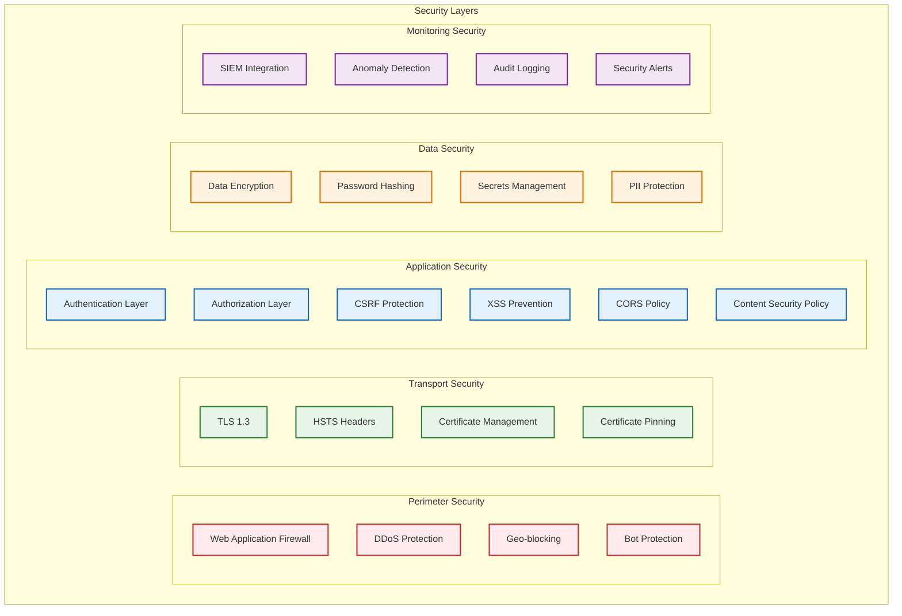

# Security Architecture

## Overview

CF-Better-Auth implements a comprehensive security model designed for enterprise applications with stringent security requirements. The architecture follows security-by-design principles, implementing defense-in-depth strategies across all layers.

## Security Architecture Diagram



## Authentication Security

### Password Security

#### Argon2id Hashing
```typescript
import { hash, verify } from '@node-rs/argon2';

const hashPassword = async (password: string): Promise<string> => {
  return await hash(password, {
    memoryCost: 65536,      // 64 MB
    timeCost: 3,            // 3 iterations
    outputLen: 32,          // 32 bytes output
    parallelism: 4,         // 4 parallel threads
    algorithm: Algorithm.Argon2id,
    version: Version.V0x13,
  });
};

const verifyPassword = async (hash: string, password: string): Promise<boolean> => {
  return await verify(hash, password);
};
```

#### Password Policy Enforcement
```typescript
interface PasswordPolicy {
  minLength: 12;
  maxLength: 128;
  requireUppercase: true;
  requireLowercase: true;
  requireNumbers: true;
  requireSpecialChars: true;
  preventCommonPasswords: true;
  preventUserInfo: true; // No name, email, username in password
  historySize: 12; // Remember last 12 passwords
  maxAge: 90; // Force change every 90 days
}
```

### Multi-Factor Authentication

#### TOTP (Time-based One-Time Password)
```typescript
import { authenticator } from 'otplib';

// Generate secret
const secret = authenticator.generateSecret();

// Verify token
const isValid = authenticator.verify({
  token: userToken,
  secret: userSecret,
  window: 1, // Allow 30-second drift
});
```

#### WebAuthn/FIDO2 Implementation
```typescript
import { generateRegistrationOptions, verifyRegistrationResponse } from '@simplewebauthn/server';

// Registration
const registrationOptions = await generateRegistrationOptions({
  rpName: 'CF-Better-Auth',
  rpID: 'auth.yourdomain.com',
  userID: userId,
  userName: userEmail,
  userDisplayName: userDisplayName,
  attestationType: 'direct',
  authenticatorSelection: {
    residentKey: 'preferred',
    userVerification: 'preferred',
    authenticatorAttachment: 'cross-platform',
  },
});

// Verification
const verification = await verifyRegistrationResponse({
  response: registrationResponse,
  expectedChallenge: expectedChallenge,
  expectedOrigin: expectedOrigin,
  expectedRPID: expectedRPID,
});
```

### Session Security

#### JWT Token Implementation
```typescript
import { SignJWT, jwtVerify } from 'jose';

// Generate access token
const accessToken = await new SignJWT({
  sub: userId,
  org: organizationId,
  role: userRole,
  permissions: userPermissions,
  session: sessionId,
})
.setProtectedHeader({ alg: 'RS256' })
.setIssuedAt()
.setExpirationTime('15m')
.setIssuer('cf-better-auth')
.setAudience('cf-better-auth-api')
.sign(privateKey);

// Verify token
const { payload } = await jwtVerify(token, publicKey, {
  issuer: 'cf-better-auth',
  audience: 'cf-better-auth-api',
});
```

#### Session Configuration
```typescript
interface SessionConfig {
  accessTokenTTL: 900;        // 15 minutes
  refreshTokenTTL: 2592000;   // 30 days
  idleTimeout: 3600;          // 1 hour
  absoluteTimeout: 86400;     // 24 hours
  multipleSessionsAllowed: true;
  secureOnly: true;           // HTTPS only
  sameSite: 'strict';         // CSRF protection
  httpOnly: true;             // XSS protection
}
```

## Authorization Security

### Role-Based Access Control (RBAC)

#### Permission System
```typescript
interface Permission {
  resource: string;    // 'users', 'organizations', 'teams'
  action: string;      // 'create', 'read', 'update', 'delete'
  conditions?: {       // Optional conditions
    own?: boolean;     // Only own resources
    orgId?: string;    // Specific organization
    teamId?: string;   // Specific team
  };
}

interface Role {
  id: string;
  name: string;
  permissions: Permission[];
  inherits?: string[]; // Role inheritance
}

// Example roles
const roles: Role[] = [
  {
    id: 'org_owner',
    name: 'Organization Owner',
    permissions: [
      { resource: 'organizations', action: '*' },
      { resource: 'users', action: '*', conditions: { orgId: '$current_org' } },
      { resource: 'teams', action: '*', conditions: { orgId: '$current_org' } },
    ]
  },
  {
    id: 'team_member',
    name: 'Team Member',
    permissions: [
      { resource: 'users', action: 'read', conditions: { own: true } },
      { resource: 'teams', action: 'read', conditions: { teamId: '$current_team' } },
    ]
  }
];
```

#### Permission Evaluation
```typescript
class PermissionEvaluator {
  async canAccess(
    user: User,
    resource: string,
    action: string,
    context: AccessContext
  ): Promise<boolean> {
    // Get user roles and permissions
    const userRoles = await this.getUserRoles(user.id, context.organizationId);
    const permissions = await this.getPermissions(userRoles);
    
    // Evaluate permissions
    return permissions.some(permission => 
      this.matchesResource(permission.resource, resource) &&
      this.matchesAction(permission.action, action) &&
      this.evaluateConditions(permission.conditions, context)
    );
  }
}
```

### API Security

#### Rate Limiting
```typescript
interface RateLimitConfig {
  // Per-IP limits
  perIP: {
    login: { requests: 5, window: 900 };      // 5 attempts per 15 min
    register: { requests: 3, window: 3600 };  // 3 registrations per hour
    api: { requests: 1000, window: 3600 };    // 1000 API calls per hour
  };
  
  // Per-user limits
  perUser: {
    api: { requests: 10000, window: 3600 };   // 10k API calls per hour
    passwordReset: { requests: 3, window: 3600 }; // 3 resets per hour
  };
  
  // Per-API-key limits
  perAPIKey: {
    requests: 100000;  // 100k requests per hour
    window: 3600;
  };
}
```

#### Input Validation & Sanitization
```typescript
import { z } from 'zod';

// Email validation schema
const emailSchema = z.string()
  .email('Invalid email format')
  .max(254, 'Email too long')
  .transform(email => email.toLowerCase().trim());

// Password validation schema
const passwordSchema = z.string()
  .min(12, 'Password must be at least 12 characters')
  .max(128, 'Password too long')
  .regex(/[A-Z]/, 'Must contain uppercase letter')
  .regex(/[a-z]/, 'Must contain lowercase letter')
  .regex(/[0-9]/, 'Must contain number')
  .regex(/[^A-Za-z0-9]/, 'Must contain special character')
  .refine(password => !commonPasswords.includes(password), 'Common password not allowed');

// Organization slug validation
const orgSlugSchema = z.string()
  .min(3, 'Slug too short')
  .max(63, 'Slug too long')
  .regex(/^[a-z0-9-]+$/, 'Only lowercase letters, numbers, and hyphens allowed')
  .refine(slug => !reservedSlugs.includes(slug), 'Reserved slug not allowed');
```

## Data Protection

### Encryption Strategy

#### Data at Rest
```typescript
// PostgreSQL encryption using pgcrypto
const encryptSensitiveData = async (data: string, key: string): Promise<string> => {
  return await db.query(
    'SELECT pgp_sym_encrypt($1, $2) as encrypted',
    [data, key]
  );
};

// Application-level encryption for additional security
import { createCipher, createDecipher } from 'crypto';

class DataEncryption {
  private readonly algorithm = 'aes-256-gcm';
  
  encrypt(data: string, key: Buffer): { encrypted: string; iv: string; tag: string } {
    const iv = crypto.randomBytes(16);
    const cipher = createCipher(this.algorithm, key);
    cipher.setAAD(Buffer.from('cf-better-auth'));
    
    let encrypted = cipher.update(data, 'utf8', 'hex');
    encrypted += cipher.final('hex');
    
    return {
      encrypted,
      iv: iv.toString('hex'),
      tag: cipher.getAuthTag().toString('hex')
    };
  }
}
```

#### Data in Transit
```nginx
# NGINX TLS Configuration
server {
    listen 443 ssl http2;
    
    # TLS 1.3 only
    ssl_protocols TLSv1.3;
    
    # Strong cipher suites
    ssl_ciphers ECDHE-ECDSA-AES256-GCM-SHA384:ECDHE-RSA-AES256-GCM-SHA384;
    ssl_prefer_server_ciphers off;
    
    # HSTS
    add_header Strict-Transport-Security "max-age=63072000; includeSubDomains; preload" always;
    
    # Certificate transparency
    ssl_ct on;
    
    # OCSP stapling
    ssl_stapling on;
    ssl_stapling_verify on;
}
```

### PII Data Protection

#### Data Classification
```typescript
enum DataClassification {
  PUBLIC = 'public',           // Name, profile picture
  INTERNAL = 'internal',       // Email, username
  CONFIDENTIAL = 'confidential', // Phone number, address
  RESTRICTED = 'restricted',   // Password hash, 2FA secrets
}

interface DataField {
  classification: DataClassification;
  encrypted: boolean;
  masked: boolean;
  retention: number; // Days
  purgeOnDelete: boolean;
}

const dataMap: Record<string, DataField> = {
  email: { classification: DataClassification.INTERNAL, encrypted: false, masked: true, retention: 2555, purgeOnDelete: false },
  passwordHash: { classification: DataClassification.RESTRICTED, encrypted: true, masked: true, retention: 365, purgeOnDelete: true },
  twoFactorSecret: { classification: DataClassification.RESTRICTED, encrypted: true, masked: true, retention: 90, purgeOnDelete: true },
  phoneNumber: { classification: DataClassification.CONFIDENTIAL, encrypted: true, masked: true, retention: 1095, purgeOnDelete: false },
};
```

#### Data Masking
```typescript
class DataMasker {
  static maskEmail(email: string): string {
    const [local, domain] = email.split('@');
    const maskedLocal = local.slice(0, 2) + '*'.repeat(local.length - 2);
    return `${maskedLocal}@${domain}`;
  }
  
  static maskPhoneNumber(phone: string): string {
    return phone.replace(/(\d{3})\d{3}(\d{4})/, '$1***$2');
  }
  
  static maskToken(token: string): string {
    return token.slice(0, 8) + '*'.repeat(token.length - 8);
  }
}
```

## Network Security

### CORS Configuration
```typescript
const corsConfig = {
  origin: (origin: string, callback: Function) => {
    const allowedOrigins = [
      'https://yourdomain.com',
      'https://app.yourdomain.com',
      'https://admin.yourdomain.com',
    ];
    
    if (!origin || allowedOrigins.includes(origin)) {
      callback(null, true);
    } else {
      callback(new Error('Not allowed by CORS'));
    }
  },
  credentials: true,
  methods: ['GET', 'POST', 'PUT', 'DELETE', 'OPTIONS'],
  allowedHeaders: ['Content-Type', 'Authorization', 'X-Requested-With'],
  exposedHeaders: ['X-Total-Count', 'X-Page-Count'],
  maxAge: 86400, // 24 hours
};
```

### Content Security Policy
```typescript
const cspConfig = {
  directives: {
    defaultSrc: ["'self'"],
    scriptSrc: [
      "'self'",
      "'unsafe-inline'", // Only for development
      "https://cdnjs.cloudflare.com",
      "https://unpkg.com",
    ],
    styleSrc: [
      "'self'",
      "'unsafe-inline'",
      "https://fonts.googleapis.com",
    ],
    fontSrc: [
      "'self'",
      "https://fonts.gstatic.com",
    ],
    imgSrc: [
      "'self'",
      "data:",
      "https:",
      "https://avatars.githubusercontent.com",
      "https://lh3.googleusercontent.com",
    ],
    connectSrc: [
      "'self'",
      "https://api.yourdomain.com",
      "wss://ws.yourdomain.com",
    ],
    frameSrc: ["'none'"],
    objectSrc: ["'none'"],
    baseUri: ["'self'"],
    formAction: ["'self'"],
    upgradeInsecureRequests: [],
  },
};
```

## Attack Prevention

### CSRF Protection
```typescript
import csrf from 'csrf';

class CSRFProtection {
  private tokens = new csrf();
  
  generateToken(session: Session): string {
    return this.tokens.create(session.secret);
  }
  
  verifyToken(token: string, session: Session): boolean {
    return this.tokens.verify(session.secret, token);
  }
  
  middleware() {
    return (req: Request, res: Response, next: NextFunction) => {
      if (['POST', 'PUT', 'DELETE', 'PATCH'].includes(req.method)) {
        const token = req.headers['x-csrf-token'] || req.body._csrf;
        if (!this.verifyToken(token, req.session)) {
          return res.status(403).json({ error: 'Invalid CSRF token' });
        }
      }
      next();
    };
  }
}
```

### XSS Prevention
```typescript
import DOMPurify from 'isomorphic-dompurify';
import xss from 'xss';

class XSSProtection {
  static sanitizeHTML(html: string): string {
    return DOMPurify.sanitize(html, {
      ALLOWED_TAGS: ['b', 'i', 'em', 'strong', 'a'],
      ALLOWED_ATTR: ['href'],
    });
  }
  
  static sanitizeInput(input: string): string {
    return xss(input, {
      whiteList: {}, // No HTML allowed
      stripIgnoreTag: true,
      stripIgnoreTagBody: ['script'],
    });
  }
  
  static setSecurityHeaders(res: Response): void {
    res.setHeader('X-Content-Type-Options', 'nosniff');
    res.setHeader('X-Frame-Options', 'DENY');
    res.setHeader('X-XSS-Protection', '1; mode=block');
    res.setHeader('Referrer-Policy', 'strict-origin-when-cross-origin');
  }
}
```

### SQL Injection Prevention
```typescript
// Always use parameterized queries
const findUserByEmail = async (email: string): Promise<User | null> => {
  // ✅ Safe - parameterized query
  const result = await db.query(
    'SELECT * FROM users WHERE email = $1 AND deleted_at IS NULL',
    [email]
  );
  
  // ❌ Dangerous - string concatenation
  // const result = await db.query(`SELECT * FROM users WHERE email = '${email}'`);
  
  return result.rows[0] || null;
};

// Use query builders with validation
import { z } from 'zod';

const userQuerySchema = z.object({
  email: z.string().email(),
  status: z.enum(['active', 'inactive', 'suspended']).optional(),
});

const queryUsers = async (params: unknown) => {
  const validated = userQuerySchema.parse(params);
  
  return db.query(
    'SELECT * FROM users WHERE email = $1 AND ($2::text IS NULL OR status = $2)',
    [validated.email, validated.status || null]
  );
};
```

## Secrets Management

### Environment Variables Security
```typescript
// secrets.ts
import { z } from 'zod';

const secretsSchema = z.object({
  DATABASE_URL: z.string().url(),
  REDIS_URL: z.string().url(),
  JWT_PRIVATE_KEY: z.string().min(1000), // RSA key
  JWT_PUBLIC_KEY: z.string().min(200),
  ENCRYPTION_KEY: z.string().length(64), // 32 bytes hex
  SMTP_PASSWORD: z.string().min(8),
  OAUTH_GOOGLE_SECRET: z.string().min(20),
  OAUTH_GITHUB_SECRET: z.string().min(20),
  WEBHOOK_SECRET: z.string().min(32),
});

export const secrets = secretsSchema.parse(process.env);
```

### Key Rotation Strategy
```typescript
class KeyRotation {
  async rotateJWTKeys(): Promise<void> {
    // Generate new key pair
    const { publicKey, privateKey } = await generateKeyPair('rs256');
    
    // Store with version
    await this.storeKey(`jwt_private_v${Date.now()}`, privateKey);
    await this.storeKey(`jwt_public_v${Date.now()}`, publicKey);
    
    // Update active keys
    await this.updateActiveKeys(publicKey, privateKey);
    
    // Keep old keys for token validation during transition
    await this.scheduleKeyCleanup(30); // 30 days
  }
  
  async rotateEncryptionKey(): Promise<void> {
    const newKey = crypto.randomBytes(32);
    
    // Re-encrypt all sensitive data with new key
    await this.reencryptData(newKey);
    
    // Update key in secure store
    await this.updateEncryptionKey(newKey);
  }
}
```

## Threat Detection & Response

### Anomaly Detection
```typescript
class SecurityMonitor {
  async detectSuspiciousActivity(user: User, request: Request): Promise<SecurityAlert[]> {
    const alerts: SecurityAlert[] = [];
    
    // Unusual login location
    const lastLocation = await this.getLastLoginLocation(user.id);
    const currentLocation = await this.getLocationFromIP(request.ip);
    
    if (this.calculateDistance(lastLocation, currentLocation) > 1000) {
      alerts.push({
        type: 'unusual_location',
        severity: 'medium',
        message: 'Login from unusual location',
        metadata: { lastLocation, currentLocation }
      });
    }
    
    // Rapid successive login attempts
    const recentAttempts = await this.getRecentLoginAttempts(request.ip);
    if (recentAttempts.length > 10) {
      alerts.push({
        type: 'brute_force',
        severity: 'high',
        message: 'Possible brute force attack',
        metadata: { attempts: recentAttempts.length }
      });
    }
    
    // Unusual device/browser
    const knownDevices = await this.getKnownDevices(user.id);
    if (!this.isKnownDevice(request.headers['user-agent'], knownDevices)) {
      alerts.push({
        type: 'new_device',
        severity: 'low',
        message: 'Login from new device',
        metadata: { userAgent: request.headers['user-agent'] }
      });
    }
    
    return alerts;
  }
}
```

### Automated Response
```typescript
class SecurityResponse {
  async handleSecurityAlert(alert: SecurityAlert, context: SecurityContext): Promise<void> {
    switch (alert.type) {
      case 'brute_force':
        // Temporarily block IP
        await this.blockIP(context.ip, { duration: 3600, reason: 'Brute force detected' });
        // Require additional verification
        await this.requireStepUpAuth(context.userId);
        break;
        
      case 'credential_stuffing':
        // Force password reset
        await this.forcePasswordReset(context.userId);
        // Revoke all sessions
        await this.revokeAllSessions(context.userId);
        break;
        
      case 'unusual_location':
        // Send security notification
        await this.sendSecurityNotification(context.userId, alert);
        // Require email verification
        await this.requireEmailVerification(context.userId);
        break;
    }
    
    // Always log security events
    await this.logSecurityEvent(alert, context);
  }
}
```

## Compliance & Auditing

### GDPR Compliance
```typescript
class GDPRCompliance {
  async exportUserData(userId: string): Promise<UserDataExport> {
    return {
      profile: await this.getUserProfile(userId),
      sessions: await this.getUserSessions(userId),
      auditLogs: await this.getUserAuditLogs(userId),
      oauthAccounts: await this.getUserOAuthAccounts(userId),
      apiKeys: await this.getUserAPIKeys(userId),
    };
  }
  
  async deleteUserData(userId: string): Promise<void> {
    // Hard delete sensitive data
    await db.transaction(async (trx) => {
      await trx('sessions').where('user_id', userId).del();
      await trx('api_keys').where('user_id', userId).del();
      await trx('oauth_accounts').where('user_id', userId).del();
      
      // Soft delete user (keep for audit trail)
      await trx('users')
        .where('id', userId)
        .update({
          deleted_at: new Date(),
          email: null,
          password_hash: null,
          two_factor_secret: null,
          // Keep minimal data for compliance
        });
    });
  }
  
  async anonymizeUserData(userId: string): Promise<void> {
    await db('users')
      .where('id', userId)
      .update({
        email: `deleted-${userId}@example.com`,
        name: 'Deleted User',
        phone_number: null,
        password_hash: null,
        two_factor_secret: null,
      });
  }
}
```

### SOC 2 Compliance
```typescript
interface SOC2Controls {
  // Security controls
  accessControl: {
    implementation: 'RBAC with principle of least privilege';
    monitoring: 'Real-time access monitoring and alerts';
    review: 'Quarterly access reviews and certification';
  };
  
  // Availability controls
  availability: {
    uptime: '99.95% SLA with monitoring';
    backups: 'Automated daily backups with testing';
    recovery: 'Documented disaster recovery procedures';
  };
  
  // Processing integrity
  integrity: {
    validation: 'Input validation and sanitization';
    errorHandling: 'Comprehensive error handling and logging';
    monitoring: 'Real-time transaction monitoring';
  };
  
  // Confidentiality
  confidentiality: {
    encryption: 'AES-256 encryption at rest and in transit';
    access: 'Need-to-know basis access controls';
    classification: 'Data classification and handling procedures';
  };
  
  // Privacy
  privacy: {
    collection: 'Minimal data collection with explicit consent';
    retention: 'Automated data retention and purging';
    rights: 'User rights management (export, delete, correct)';
  };
}
```

## Security Testing

### Penetration Testing Checklist
```typescript
interface SecurityTestSuite {
  authentication: [
    'Brute force attack resistance',
    'Credential stuffing prevention',
    'Session fixation protection',
    'Password policy enforcement',
    'MFA bypass attempts',
  ];
  
  authorization: [
    'Privilege escalation attempts',
    'Horizontal authorization bypass',
    'Vertical authorization bypass',
    'IDOR (Insecure Direct Object Reference)',
    'Role manipulation attacks',
  ];
  
  injection: [
    'SQL injection testing',
    'NoSQL injection testing',
    'LDAP injection testing',
    'Command injection testing',
    'XPath injection testing',
  ];
  
  xss: [
    'Reflected XSS testing',
    'Stored XSS testing',
    'DOM-based XSS testing',
    'CSP bypass attempts',
    'Filter evasion techniques',
  ];
  
  csrf: [
    'CSRF token validation',
    'SameSite cookie testing',
    'Referer header validation',
    'Double-submit cookie verification',
    'State parameter validation',
  ];
}
```

### Automated Security Scanning
```yaml
# GitHub Actions security workflow
name: Security Scan
on:
  push:
    branches: [main, develop]
  pull_request:
    branches: [main]

jobs:
  security:
    runs-on: ubuntu-latest
    steps:
      - uses: actions/checkout@v4
      
      - name: SAST Scan
        uses: github/codeql-action/analyze@v2
        with:
          languages: typescript, javascript
          
      - name: Dependency Scan
        run: |
          npm audit --audit-level=high
          npx audit-ci --high
          
      - name: Secret Scan
        uses: trufflesecurity/trufflehog@main
        with:
          path: ./
          base: main
          head: HEAD
          
      - name: Container Scan
        uses: aquasecurity/trivy-action@master
        with:
          image-ref: cf-better-auth:latest
          format: sarif
          output: trivy-results.sarif
```

## Incident Response

### Security Incident Classification
```typescript
enum IncidentSeverity {
  CRITICAL = 'critical',    // Active breach, data exposure
  HIGH = 'high',           // Successful attack, privilege escalation
  MEDIUM = 'medium',       // Failed attack with impact
  LOW = 'low',            // Suspicious activity, failed attempts
  INFO = 'info',          // Security events, normal activity
}

interface SecurityIncident {
  id: string;
  severity: IncidentSeverity;
  type: string;
  description: string;
  affectedUsers: string[];
  affectedOrganizations: string[];
  detectedAt: Date;
  reportedAt: Date;
  resolvedAt?: Date;
  actions: IncidentAction[];
  postMortem?: string;
}
```

### Response Procedures
```typescript
class IncidentResponse {
  async handleCriticalIncident(incident: SecurityIncident): Promise<void> {
    // Immediate containment
    if (incident.type === 'data_breach') {
      await this.enableEmergencyMode();
      await this.revokeAllSessions();
      await this.disableAPIAccess();
    }
    
    // Notification (within 72 hours for GDPR)
    await this.notifyAffectedUsers(incident.affectedUsers);
    await this.notifyRegulators(incident);
    await this.notifyInsuranceProvider(incident);
    
    // Investigation
    await this.preserveForensicEvidence();
    await this.startInvestigation(incident);
    
    // Recovery
    await this.implementFixes();
    await this.restoreNormalOperation();
    
    // Post-incident
    await this.conductPostMortem(incident);
    await this.updateSecurityPolicies();
  }
}
```

## Security Monitoring

### Real-time Monitoring
```typescript
class SecurityMonitoring {
  private readonly metrics = new Map<string, number>();
  
  async trackSecurityMetric(metric: string, value: number): Promise<void> {
    this.metrics.set(`security.${metric}`, value);
    
    // Check against thresholds
    const threshold = await this.getThreshold(metric);
    if (value > threshold) {
      await this.triggerAlert({
        type: 'threshold_exceeded',
        metric,
        value,
        threshold,
      });
    }
  }
  
  async generateSecurityReport(): Promise<SecurityReport> {
    return {
      period: 'last_24_hours',
      metrics: {
        loginAttempts: this.metrics.get('security.login_attempts') || 0,
        failedLogins: this.metrics.get('security.failed_logins') || 0,
        suspiciousActivity: this.metrics.get('security.suspicious_activity') || 0,
        blockedIPs: this.metrics.get('security.blocked_ips') || 0,
        securityAlerts: this.metrics.get('security.alerts') || 0,
      },
      topThreats: await this.getTopThreats(),
      recommendations: await this.getSecurityRecommendations(),
    };
  }
}
```

### Alert Configuration
```yaml
# Security alerts configuration
alerts:
  brute_force:
    threshold: 10 # failed attempts
    window: 300   # 5 minutes
    action: block_ip
    duration: 3600 # 1 hour
    
  unusual_location:
    distance: 1000 # km
    action: require_mfa
    notify: email
    
  mass_login_failures:
    threshold: 100 # failures
    window: 60     # 1 minute
    action: emergency_mode
    notify: [email, slack, pagerduty]
    
  credential_stuffing:
    threshold: 50  # attempts
    window: 300    # 5 minutes
    action: [block_ip, require_captcha]
    duration: 7200 # 2 hours
```

## Security Best Practices

### Development Security
1. **Secure Coding Standards**: ESLint security rules, SonarQube analysis
2. **Dependency Management**: Regular updates, vulnerability scanning
3. **Code Review**: Security-focused peer review process
4. **Static Analysis**: Automated security scanning in CI/CD
5. **Dynamic Testing**: Regular penetration testing

### Operational Security
1. **Principle of Least Privilege**: Minimal necessary access
2. **Defense in Depth**: Multiple security layers
3. **Zero Trust**: Verify everything, trust nothing
4. **Regular Updates**: Security patches and updates
5. **Incident Preparedness**: Response plans and procedures

### Data Security
1. **Encryption Everywhere**: At rest, in transit, in use
2. **Access Logging**: Comprehensive audit trails
3. **Data Minimization**: Collect only necessary data
4. **Retention Policies**: Automated data lifecycle management
5. **Privacy by Design**: Built-in privacy protection

This security architecture provides enterprise-grade protection for CF-Better-Auth while maintaining usability and performance. Regular security reviews and updates ensure the system remains protected against evolving threats.