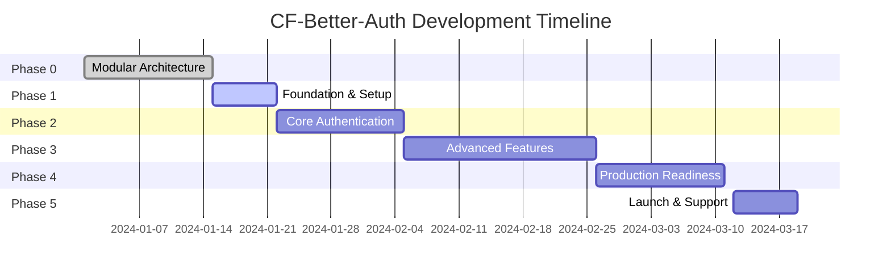

# CF-Better-Auth Project Timeline & Milestones

## Project Overview
**Start Date**: Current  
**Target Production Release**: 4 months  
**Development Methodology**: Agile with 2-week sprints  

## Phase Timeline

## Detailed Milestone Definitions

### Phase 0: Modular Architecture Setup ✅ **COMPLETED**
**Duration**: 2 weeks  
**Status**: 100% Complete

#### Delivered:
- ✅ Git repository with better-auth submodule
- ✅ Modular package structure (@cf-auth/*)
- ✅ Adapter pattern implementation
- ✅ Docker infrastructure
- ✅ CI/CD pipelines
- ✅ Core documentation

---

### Phase 1: Project Foundation & Setup 🚧 **IN PROGRESS**
**Duration**: 1 week  
**Target Completion**: End of Week 1

#### Milestone 1.1: Executive Planning ⏳
**Timeline**: Day 1-2
- [ ] Complete executive overview documentation
- [ ] Validate project requirements
- [ ] Finalize architecture decisions
- [ ] Set up project management tools
- [ ] Create communication channels

#### Milestone 1.2: System Architecture 
**Timeline**: Day 3-4
- [ ] Design high-level architecture diagrams
- [ ] Document API specifications
- [ ] Define database schemas
- [ ] Plan microservices communication
- [ ] Create security architecture

#### Milestone 1.3: Development Environment
**Timeline**: Day 5-7
- [ ] Complete monorepo setup
- [ ] Configure development tools
- [ ] Set up local development environment
- [ ] Create development guidelines
- [ ] Initialize testing framework

**Deliverables**:
- Complete project documentation
- Architecture diagrams and specifications
- Development environment ready
- Team onboarding materials

---

### Phase 2: Core Authentication Implementation
**Duration**: 2 weeks  
**Target Completion**: End of Week 3

#### Milestone 2.1: Basic Authentication (Week 2)
**Timeline**: Day 8-11
- [ ] Implement email/password authentication
- [ ] Create session management
- [ ] Build user registration flow
- [ ] Implement password reset
- [ ] Add email verification

#### Milestone 2.2: Security Features (Week 2-3)
**Timeline**: Day 12-14
- [ ] Implement rate limiting
- [ ] Add CSRF protection
- [ ] Create audit logging
- [ ] Implement secure headers
- [ ] Add input validation

#### Milestone 2.3: API Development (Week 3)
**Timeline**: Day 15-18
- [ ] Create RESTful endpoints
- [ ] Implement GraphQL schema
- [ ] Add WebSocket support
- [ ] Create API documentation
- [ ] Implement API versioning

#### Milestone 2.4: Testing & Validation (Week 3)
**Timeline**: Day 19-21
- [ ] Unit test coverage >80%
- [ ] Integration testing
- [ ] E2E test scenarios
- [ ] Security testing
- [ ] Performance benchmarking

**Deliverables**:
- Working authentication system
- Comprehensive API
- Test suite with >80% coverage
- Security audit report

---

### Phase 3: Advanced Features
**Duration**: 3 weeks  
**Target Completion**: End of Week 6

#### Milestone 3.1: Multi-Factor Authentication (Week 4)
**Timeline**: Day 22-28
- [ ] TOTP implementation
- [ ] SMS OTP support
- [ ] Email OTP
- [ ] Backup codes
- [ ] Recovery flows

#### Milestone 3.2: Social Authentication (Week 5)
**Timeline**: Day 29-35
- [ ] OAuth 2.0 implementation
- [ ] Google provider
- [ ] GitHub provider
- [ ] Microsoft provider
- [ ] Custom OAuth support

#### Milestone 3.3: Organization Management (Week 5-6)
**Timeline**: Day 36-42
- [ ] Multi-tenancy support
- [ ] Team management
- [ ] Role-based access control
- [ ] Permissions system
- [ ] Invitation system

#### Milestone 3.4: Advanced Security (Week 6)
**Timeline**: Day 43-45
- [ ] WebAuthn/Passkeys
- [ ] Device fingerprinting
- [ ] Anomaly detection
- [ ] IP whitelisting
- [ ] Geolocation restrictions

**Deliverables**:
- Complete MFA system
- Social authentication providers
- Organization management
- Advanced security features

---

### Phase 4: Production Readiness
**Duration**: 2 weeks  
**Target Completion**: End of Week 8

#### Milestone 4.1: Performance Optimization (Week 7)
**Timeline**: Day 46-49
- [ ] Database optimization
- [ ] Caching implementation
- [ ] CDN configuration
- [ ] Load testing
- [ ] Bottleneck resolution

#### Milestone 4.2: Monitoring & Observability (Week 7)
**Timeline**: Day 50-52
- [ ] Logging infrastructure
- [ ] Metrics collection
- [ ] Health checks
- [ ] Alert configuration
- [ ] Dashboard creation

#### Milestone 4.3: Documentation (Week 8)
**Timeline**: Day 53-56
- [ ] API documentation
- [ ] User guides
- [ ] Admin documentation
- [ ] Developer guides
- [ ] Video tutorials

#### Milestone 4.4: Deployment (Week 8)
**Timeline**: Day 57-60
- [ ] Production environment setup
- [ ] CI/CD finalization
- [ ] Backup strategies
- [ ] Disaster recovery
- [ ] Security hardening

**Deliverables**:
- Production-ready system
- Complete documentation
- Monitoring infrastructure
- Deployment automation

---

### Phase 5: Launch & Initial Support
**Duration**: 1 week  
**Target Completion**: End of Week 9

#### Milestone 5.1: Beta Testing
**Timeline**: Day 61-62
- [ ] Beta user onboarding
- [ ] Feedback collection
- [ ] Bug fixes
- [ ] Performance tuning

#### Milestone 5.2: Production Launch
**Timeline**: Day 63-64
- [ ] Production deployment
- [ ] DNS configuration
- [ ] SSL certificates
- [ ] Monitoring activation

#### Milestone 5.3: Post-Launch Support
**Timeline**: Day 65-67
- [ ] User support setup
- [ ] Issue tracking
- [ ] Hotfix procedures
- [ ] Performance monitoring

**Deliverables**:
- Live production system
- Support infrastructure
- Launch documentation
- Marketing materials

---

## Sprint Planning

### Sprint 1 (Week 1-2): Foundation
- Phase 1 completion
- Phase 2 start
- Core authentication MVP

### Sprint 2 (Week 3-4): Core Features
- Phase 2 completion
- Basic feature set complete
- Alpha release

### Sprint 3 (Week 5-6): Advanced Features
- Phase 3 implementation
- MFA and social auth
- Beta release preparation

### Sprint 4 (Week 7-8): Production Ready
- Phase 4 completion
- Performance optimization
- Documentation finalization

### Sprint 5 (Week 9): Launch
- Phase 5 execution
- Production deployment
- Post-launch support

## Success Criteria

### Phase 1 Success Metrics
- Development environment operational
- All team members onboarded
- Architecture documented and approved

### Phase 2 Success Metrics
- Basic authentication working
- Test coverage >80%
- Security audit passed

### Phase 3 Success Metrics
- All advanced features operational
- Performance benchmarks met
- Integration tests passing

### Phase 4 Success Metrics
- Load testing successful (10k concurrent users)
- Documentation complete
- Zero critical bugs

### Phase 5 Success Metrics
- Successful production deployment
- <100ms response times
- 99.9% uptime in first week

## Risk Management

### High-Risk Items
1. **Better-auth compatibility**: Mitigated by adapter pattern
2. **Performance at scale**: Addressed in Phase 4
3. **Security vulnerabilities**: Continuous security testing
4. **Documentation completeness**: Dedicated sprint time

### Contingency Plans
- Buffer time built into each phase
- Parallel work streams where possible
- Regular checkpoint reviews
- Flexible scope prioritization

## Resource Requirements

### Development Team
- 2-3 Full-stack developers
- 1 DevOps engineer
- 1 UI/UX designer
- 1 Technical writer

### Infrastructure
- Development servers
- Staging environment
- Production infrastructure
- Monitoring tools

### Tools & Services
- GitHub repository
- CI/CD platform
- Cloud hosting
- Domain and SSL certificates

## Communication Plan

### Daily
- Stand-up meetings
- Slack updates
- Commit messages

### Weekly
- Sprint planning/review
- Progress reports
- Stakeholder updates

### Milestone
- Phase completion reviews
- Documentation updates
- Release notes

## Conclusion

This timeline provides a clear path from current state to production launch in approximately 9 weeks. The phased approach allows for iterative development with regular milestones and clear success metrics. Buffer time is included for unexpected challenges, and the modular architecture allows for parallel development where possible.